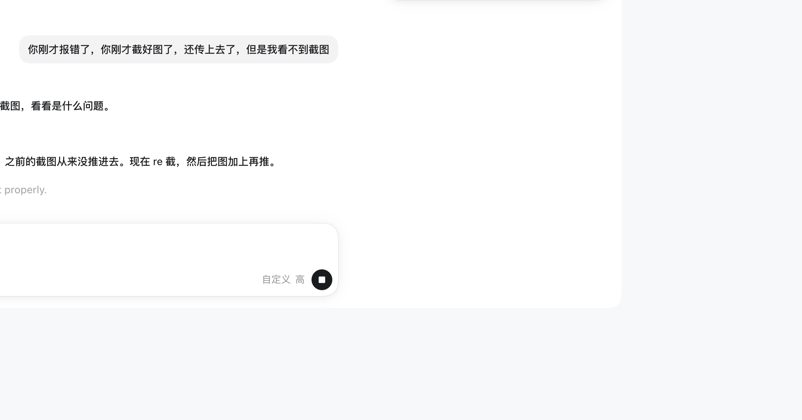
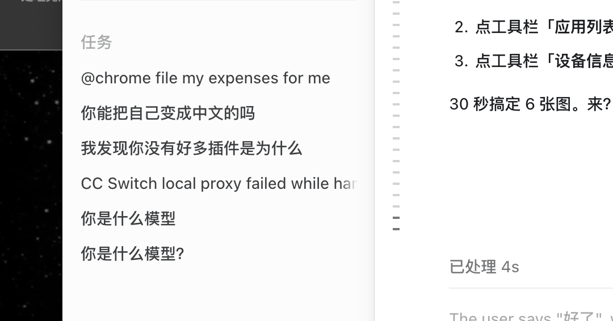
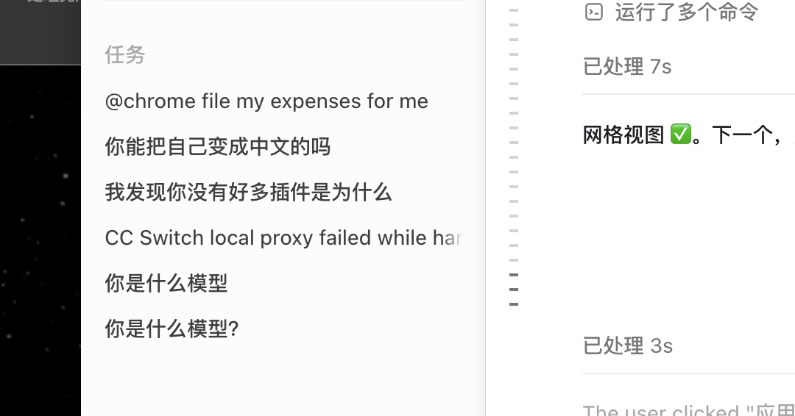
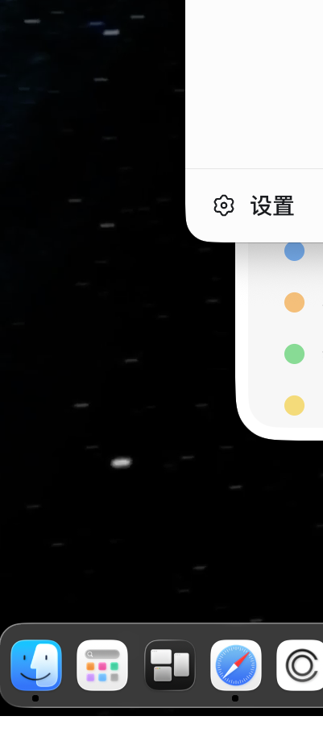
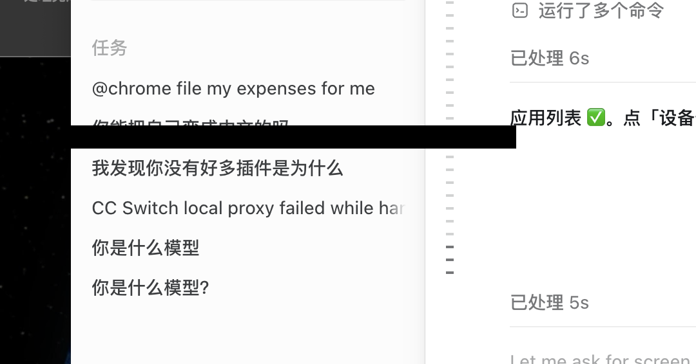
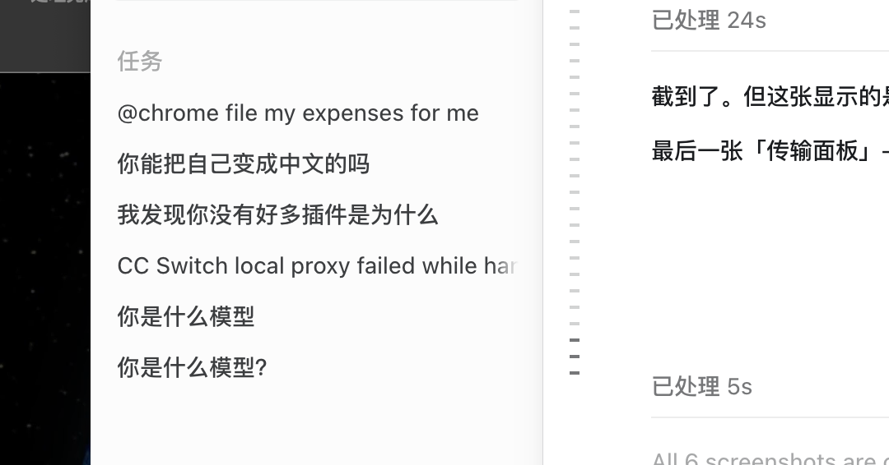

<p align="center">
  
</p>

<h1 align="center">安卓文件小助理</h1>
<p align="center">macOS 原生安卓文件管理器 · 零依赖 · 开箱即用</p>

<p align="center">
  <a href="#-下载"><b>⬇️ 立即下载</b></a> &nbsp;·&nbsp;
  <a href="#-功能">功能</a> &nbsp;·&nbsp;
  <a href="#-截图">截图</a> &nbsp;·&nbsp;
  <a href="#-使用">使用</a>
</p>

---

## 📥 下载

👉 **[点击下载最新 DMG (v4.1)](https://github.com/wordwu/android-file-manager/releases)**

> 首次打开时，macOS 可能提示"无法验证开发者"。**系统设置 → 隐私与安全性** → 点击"仍要打开"即可。

---

## 📸 截图

<!-- TODO: 替换为实际截图 -->
<!-- 截屏快捷键: Shift+Cmd+4 然后按空格键，点击 app 窗口即可 -->

| 文件浏览 | 图标网格 | 应用管理 |
|:---:|:---:|:---:|
|  |  |  |

| 屏幕镜像 | 设备信息 | 传输面板 |
|:---:|:---:|:---:|
|  |  |  |

---

## ✨ 功能

- 📱 **USB / WiFi 无线**双模式连接，一键切 TCP
- 📂 **文件浏览**：列表 / 图标网格双视图，图片缩略图实时加载
- 📋 **剪切/复制/粘贴**，重名自动编号
- 🔍 **递归搜索**，300ms 防抖，100 条结果
- 📤 **拖拽上传**到设备 + 快捷键下载到 Mac
- 📦 **应用管理**：列出所有应用、导出 APK、安装/卸载
- 📊 **设备信息**：电池、存储、系统版本一目了然
- 📞 **通话记录**查看（多厂商 URI 适配）
- 🪞 **屏幕镜像**（内嵌 scrcpy，鼠标/键盘实时操控手机）
- 🏷️ **批量重命名**：前缀/后缀/替换/编号四种模式

---

## 🔧 使用

### 连接手机

1. 手机开启 **开发者选项 → USB 调试**
2. 数据线连电脑，手机上点「允许」
3. 侧边栏自动出现设备

### 无线连接

1. 确保手机和电脑同一 WiFi
2. USB 连接后点击设备旁的 **📡 图标**
3. 拔线，无线设备自动出现

### 快捷键

| 按键 | 操作 |
|------|------|
| `⌘C` / `⌘X` / `⌘V` | 复制 / 剪切 / 粘贴 |
| `⌘D` | 下载到 ~/Downloads |
| `⌘F` | 搜索 |
| `Delete` | 删除 |
| `Cmd+点击` | 多选 |
| `F11` | 屏幕镜像全屏 |

---

## 💻 系统要求

- macOS 15.0+
- Apple Silicon (M1/M2/M3/M4)
- Android 4.0+ (USB)，5.0+ (无线)

---

## 👨‍💻 开发

```bash
git clone https://github.com/wordwu/android-file-manager.git
cd android-file-manager
swift build        # 编译
swift test         # 测试
./build.sh         # 打包 .app
```

- **架构**：SwiftUI + MVVM
- **依赖**：内嵌 ADB，零外部依赖
- **体积**：安装包约 32MB

---

## 🧾 English

**Android File Assistant** — a native macOS Android file manager. Zero external dependencies, plug and play.

- USB & wireless ADB connections
- File browser with list/grid views and image thumbnails
- Cut/copy/paste with auto-numbering on name conflicts
- Recursive search with 300ms debounce
- Drag-and-drop upload, keyboard shortcut download
- App management (list, export APKs, install/uninstall)
- Device info (battery, storage, system version)
- Call log viewer
- Screen mirroring via built-in scrcpy
- Batch rename (prefix/suffix/replace/numbering)

**Download**: [Latest DMG](https://github.com/wordwu/android-file-manager/releases)

**Requirements**: macOS 15.0+, Apple Silicon, Android 4.0+

---

## 📝 更新日志

### v4.1 (2026-06-23)
- 大文件夹性能翻倍：缓存分页，首屏 ~1.6s，翻页 ~0.03s
- pipe 死锁修复：后台异步消费 stdout/stderr
- 一次性全量加载 20000 条
- 滚动位置保持：追加不重排
- 元数据补全：自动 ls -la 更新大小/日期
- 视频/音频双击播放

### v4.0 (2026-06-21)
- 文件列表分页加载（每批 2000 条）
- 缩略图 4 并发异步加载
- >5MB 文件跳过缩略图
- 底部显示总大小
- 「加载更多」按钮

---

<p align="center">
  <sub>Made with ❤️ by <a href="https://github.com/wordwu">wordwu</a></sub>
</p>
